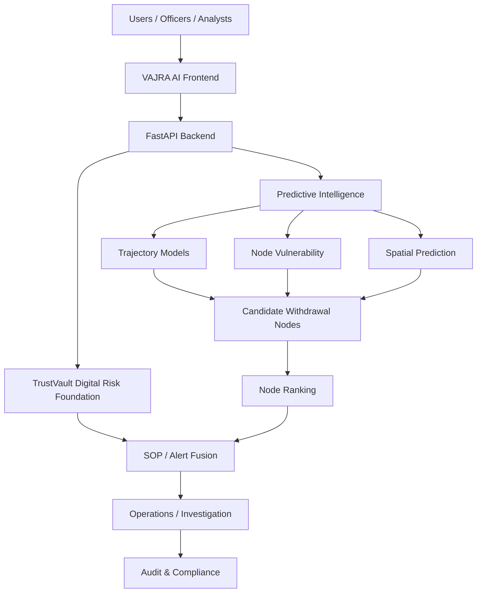

# VAJRA AI

> **Predictive Cybercrime Intelligence & Cash-Out Interception Platform**

VAJRA AI is an AI-powered intelligence and decision-support platform for forecasting likely cash-withdrawal locations from cybercrime, financial, behavioral, geospatial, and relationship signals. It connects TrustVault digital risk intelligence with physical cash-out prediction, operational alerting, investigation workflows, and auditable SOP-based decision support.

Internally, VAJRA AI is powered by two fused engines rather than one: the **Digital Detector**, which provides identity and transaction-level AML intelligence, and the **Physical Prediction Engine**, the original Vajra core for geospatial cash-out forecasting. Together they close the full loop: the Digital Detector catches the mule network while it is forming and moving money, and the Physical Prediction Engine forecasts where that money will turn into cash. Neither replaces I4C's existing systems, including NCRP, CFCFRMS, Samanvaya, the Suspect Registry, and Pratibimb; both sit on top of them.

The single end-to-end question VAJRA AI answers is: **"Is this account a mule, and if so, where and when will it cash out?"** The question is asked at onboarding, continuously during every transaction, and conclusively when layering behaviour is confirmed.

**Problem Statement 26184** · *Development of a Predictive Analytics Framework for Cybercrime Complaints to Forecast Likely Cash Withdrawal Locations in Advance, Enabling Generation of Actionable Intelligence for Timely and Proactive Cybercrime Intervention.*


## 🚀 Try Our Live Demo

Explore the deployed VAJRA AI predictive cybercrime intelligence and cash-out forecasting platform:

- **Frontend Application (Vercel):** 🚀 [Launch VAJRA AI Demo](https://vajra-ai-phi.vercel.app/)
- **Backend API (Render):** ⚡ [Open VAJRA AI API](https://vajra-ai-0q3q.onrender.com/)
- **Interactive Swagger Documentation:** 📄 [Open Swagger UI](https://vajra-ai-0q3q.onrender.com/docs)

The frontend is deployed on Vercel and the FastAPI backend is deployed on Render. The frontend build uses `VITE_API_URL` to target the backend origin.

---

| Domain | Problem Statement | Primary Focus | Deployment | Architecture Status |
| --- | --- | --- | --- | --- |
| Cybercrime Intelligence & Cash-Out Prediction | **SIH PS 26184** | Predictive risk analysis, likely withdrawal locations, and proactive intervention support | Vercel + Render | Deployed Prototype |

| Project field | Details |
| --- | --- |
| Organization | Ministry of Home Affairs |
| Department | Indian Cyber Crime Coordination Centre (I4C), CIS Division |
| Category | Software |
| Theme | Blockchain & Cybersecurity |
| Technology focus | FastAPI, React, predictive ML, geospatial intelligence, graph analysis, SSE, auditability |

---

## Problem Statement 26184

### Problem Background

The National Cybercrime Reporting Portal is a centralized platform serving the country. Citizens can file cybercrime complaints, while Law Enforcement Agencies (LEAs), banking and financial institutions, and other stakeholders act on those complaints and use related reports and analytical information.

The problem statement describes a rapidly increasing complaint volume of approximately **8,000 complaints per day**. This scale creates a need for proactive and predictive intelligence rather than relying only on reactive investigation after funds have moved or been withdrawn.

The objective is to use historical cybercrime and financial data to forecast likely cash-withdrawal locations so that LEAs can take timely preventive action. This intelligence can support state-level and local-level LEAs, I4C coordination, banks, financial institutions, ATM and withdrawal infrastructure operators, and cybercrime investigation teams.

VAJRA AI is intended to generate proactive intelligence and decision support. It does not autonomously perform real-world law-enforcement, banking, seizure, freezing, or arrest actions.

## VAJRA AI Solution

VAJRA AI addresses Problem Statement 26184 by combining:

1. Digital financial and cyber-risk intelligence
2. Behavioral risk analysis
3. Sequence analysis
4. Graph-based relationship analysis
5. IP-to-geolocation trajectory analysis
6. Cash-out node vulnerability analysis
7. Spatial prediction
8. Candidate withdrawal-node ranking
9. Cross-border risk detection
10. SOP-based risk fusion
11. Geospatial visualization
12. Real-time alerting
13. Law-enforcement operational workflows
14. Audit and compliance mechanisms

The result is a connected intelligence workflow that helps analysts and authorized officers move from a digital risk signal to explainable candidate locations, prioritized alerts, and documented operational decisions.

## TrustVault Digital Risk Foundation

TrustVault is not a separate product. It is the digital risk foundation within the VAJRA AI architecture:

```text
VAJRA AI
├── TrustVault Digital Risk Foundation
├── Predictive Physical Intelligence
├── Spatial Cash-Out Prediction
├── Operational Intelligence
├── Alerting / SOP Fusion
└── Audit & Compliance
```

TrustVault provides the digital AML and risk intelligence foundation. VAJRA AI extends that intelligence into predictive physical cash-out location analysis, investigation, and operational decision support.

## Predictive Analytics Engine

### Digital Risk Intelligence

The TrustVault digital risk layer combines a Rules Engine, Behavioral LightGBM, Sequence LSTM, and Graph ML. The current conceptual fusion is:

| Signal | Weight |
| --- | ---: |
| Rules | 25% |
| Behavioral | 30% |
| Sequence | 25% |
| Graph | 20% |

These percentages describe the platform's prototype scoring design; they are not legal, regulatory, or evidentiary standards.

### Physical Intelligence

```text
IP-to-Geo Trajectory
     ↓
Node Vulnerability
     ↓
Spatial Region Prediction
     ↓
Candidate Withdrawal Nodes
     ↓
Top-K Node Ranking
     ↓
Operational Intelligence
```

The repository implements these model families through the trajectory, node vulnerability, spatial prediction, node ranking, cross-border, SOP fusion, fairness, syndicate, and orchestration services documented below.

## Predictive Cash-Out Intelligence

VAJRA AI forecasts likely cash-withdrawal locations by combining cybercrime and financial intelligence, digital transaction risk, IP/location trajectory information, historical withdrawal behavior, withdrawal-node characteristics, geographic relationships, risk and temporal patterns, candidate-node proximity, and contextual information.

```text
Cybercrime / Financial Intelligence
          ↓
Digital Risk Analysis
          ↓
Trajectory Analysis
          ↓
Spatial Risk Prediction
          ↓
Candidate Node Generation
          ↓
Node-Level Ranking
          ↓
Top Predicted Cash-Out Locations
          ↓
Operational Alert / Intelligence
```

## Key Deliverables

### A. Predictive Analytics Engine

AI/ML analysis of historical cybercrime and financial signals for predictive scoring, pattern detection, geospatial risk modelling, real-time intelligence, and candidate withdrawal-location ranking.

### B. Risk Heatmap Dashboard

The GIS-enabled console provides risk visualization, predicted risk zones, geographic drill-down, operational map views, predicted withdrawal nodes, high-risk corridors, and supported time, location, and risk filters.

### C. Law Enforcement Interface

The investigator and officer surfaces provide alerts, cases, intelligence, graph investigation, predicted cash-out locations, officer workflows, evidence and documentation support, and audit information. These are decision-support workflows requiring authorized human action.

### D. Alert & Notification System

The platform provides dashboard alerts, risk escalation, bank and financial-institution intelligence workflows, law-enforcement alert views, SLA monitoring, and Server-Sent Event streams for transactions and alerts where the deployed infrastructure supports them.

## System Architecture



## Frontend Modules

The implemented React console includes routes for the Command Center dashboard, Operations Heatmap, Transaction Monitor, Alert Center, Mule Ring Investigator, Graph Explorer, Cases, Account 360, Node Management, High-Risk Corridors, SOP Triage, Legal Dossier Vault, Audit & Compliance Ledger, Fairness Audit, Beat Officer Field Mode, Model Performance, Live Simulation, Officer Review, Reports, Settings, and supporting investigation views.

## Realtime Intelligence

The frontend subscribes to Server-Sent Event streams for transactions and alerts and merges incoming events into the live feed, alert views, dashboard metrics, and graph snapshots. The backend also includes SLA monitoring and operational dispatch updates. Realtime behavior depends on the deployed API, CORS configuration, and service availability; the platform preserves loading, empty, error, and reconnecting states rather than fabricating successful data.

## Audit, Explainability & Compliance

Implemented governance and traceability mechanisms include:

- SHA-256 block-linked audit events and chain reverification
- Transaction, alert, case, SOP, dispatch, and dossier audit records
- Explainability panels and evidence summaries for investigation workflows
- Legal dossier generation with document hashing as a prototype evidence workflow
- Model evaluation and prediction traceability surfaces
- Fairness analysis as a non-scoring governance layer

Prototype-generated documents and scores are not legal authority or a substitute for authorized human review.

## Model Governance

The repository includes model evaluation reports, calibration artifacts, temporal and split validation utilities, leakage audits, fairness reports, explainability support, and audit logging. The evaluation material is based on repository datasets and prototype workflows; results should not be interpreted as validation on national cybercrime data.

## Data and Synthetic Data

Prototype data used for demonstration and evaluation may be synthetic and should not be interpreted as real national cybercrime data. This repository does not claim access to National Cybercrime Reporting Portal data, government databases, banking systems, I4C systems, or law-enforcement systems. Any operational integration requires authorized data access, security controls, and institutional governance.

## Limitations & Responsible Use

VAJRA AI is a prototype intelligence and decision-support platform. Predictions indicate candidate risks and locations, not certainty. Human investigators, authorized officers, banks, and other responsible institutions must validate signals before taking action. Authentication, durable production storage, data provenance, model drift monitoring, and operational integrations require further hardening before public or sensitive deployment.

## Future Scope

Future work may include authorized institutional data integrations, stronger identity and role-based access controls, durable production storage, calibrated live feedback loops, drift monitoring, expanded geographic validation, and operationally governed integrations with approved banking and law-enforcement systems.

## 1. Executive System Overview

**VAJRA AI** is an enterprise-grade defensive cybercrime analytics and predictive interception platform. Built to combat organized financial cybercrime, mule account networks, and rapid physical ATM cash-outs, VAJRA AI bridges the gap between digital fraud detection and physical law enforcement dispatch.

Unlike traditional reactive AML systems that only generate alerts after money has vanished, **VAJRA AI** forecasts physical cash-out locations up to **30 minutes in advance**, enabling proactive police patrol dispatch, bank step-up authentication, court-admissible legal dossier compilation, and tamper-evident audit logging.

```
              Digital AML Risk Engine
          (Onboarding & Transaction Core)
                         │
                         ▼
               VAJRA AI Orchestrator
                         │
        ┌────────────────┼────────────────┐
        ▼                ▼                ▼
     Model 1          Model 2          Model 5
   Trajectory        Node Risk       Cross-Border
        │                │                │
        └────────────────┼────────────────┘
                         ▼
              Spatial Candidate Gen (Top-20)
                         │
                         ▼
               Model 3 Region Classifier
                         │
                         ▼
               Model 4 Node Top-K Re-Ranker
                         │
                      Top-3 Nodes
                         │
                         ▼
               Model 5 Cross-Border Override Check
                         │
        ┌────────────────┴────────────────┐
        │                                 │
  FALSE (Normal)                   TRUE (Override)
        │                                 │
        ▼                                 ▼
   Model 6 Fusion & Calibration    INTERNATIONAL_ALERT_OVERRIDE
   (0.45 Dig + 0.35 Phys + 0.20 Ctx)      │
        │                                 │
        └────────────────┬────────────────┘
                         ▼
                  SOP Action Tier
                         │
        ┌────────────────┴────────────────┐
        ▼                                 ▼
   Police / PCR Patrol Dispatch    Bank / SOC Step-Up Auth
        │                                 │
        └────────────────┬────────────────┘
                         ▼
               Court Legal Dossier Vault (PDF)
                         │
                         ▼
           Append-Only Cryptographic Audit Ledger (SHA-256)
```

---

## 2. Platform Capabilities

- **Digital Risk Analysis**: 4-tier digital fusion combining Rules (25%), Behavioral LightGBM (30%), Sequence LSTM (25%), and Graph ML (20%) with decision bands (`>=0.92 BLOCK`, `>=0.70 REVIEW`, `>=0.50 MONITOR`, `<0.50 ALLOW`).
- **IP-to-Geo Trajectory Projection (Model 1)**: Forecasts target geographic coordinates and movement vectors from session telemetry.
- **Terminal Node Vulnerability Scoring (Model 2)**: Evaluates terminal risk across ATMs, Micro-ATMs, AePS CSPs, and POS nodes.
- **Coarse Spatial Region Prediction (Model 3)**: Spatial XGBoost classifier predicting regional cash-out corridors.
- **Top-K Candidate Re-Ranking (Model 4)**: Re-ranks Top-20 spatial candidates to select Top-3 operational cash-out terminals with **99.20% Hit@3 Precision**.
- **Cross-Border Early Warning (Model 5)**: Detects overseas flight risks and executes an **isolated override** bypassing standard weighted fusion sums.
- **SOP Fusion Engine & Isotonic Calibration (Model 6)**: Fuses Digital (45%), Physical (35%), and Contextual (20%) scores, applying Isotonic Calibration to map scores to operational SOP tiers.
- **Fairness & Bias Governance (Model 7)**: Non-scoring diagnostic layer calculating Disparate Impact Ratios (DIR) across 11 regional demographic groups.
- **Syndicate Fingerprint Matcher (Model 8)**: Investigative cosine pattern matcher classifying multi-hop layering tactics (`RAPID_MULE_FANOUT`, etc.).
- **Tactical Dispatch**: Police PCR patrol unit geofence dispatch & Bank SOC step-up authentication.
- **Legal Dossier Vault**: Court-admissible PDF generation with embedded SHA-256 evidence hashing.
- **Cryptographic Audit Ledger**: Tamper-evident append-only SHA-256 block-linked audit log.
- **Beat Officer Field Mode**: PWA touch-optimized interface for mobile patrol officers with live SSE alert streaming.

---

## 3. Machine Learning Architecture Summary

All 8 ML models are verified against holdout datasets in `backend/evaluation/`:

| Model | Purpose | Algorithm | Dataset | Main Metric | Score | Baseline |
| :--- | :--- | :--- | :--- | :--- | :--- | :--- |
| **Model 1** | IP-Geo Trajectory | RandomForest | `ip_geo_sessions_clean.csv` | Top-1 Accuracy | **95.41%** | 23.52% |
| **Model 2** | Node Vulnerability | XGBRegressor | `node_features.csv` | $R^2$ Score | **0.9987** | 0.1477 (MAE) |
| **Model 3** | Spatial Region | XGBClassifier | `vajra_feature_dataset.csv` | Top-1 Accuracy | **15.76%** | 16.67% |
| **Model 4** | Node Re-Ranker | XGBClassifier | `node_ranking_candidates.csv` | Hit@3 (Precision) | **99.20%** | 0.13% |
| **Model 5** | Cross-Border Warning | LogisticRegression | `cross_border_features.csv` | ROC-AUC | **0.9975** | — |
| **Model 6** | SOP Calibration | Isotonic Fusion | `vajra_feature_dataset.csv` | Brier Score | **0.0001** | 0.2146 (Raw) |
| **Model 7** | Fairness Audit | Equity Auditor | `users_clean.csv` | Mean DIR | **1.0041** | 1.00 |
| **Model 8** | Syndicate Matcher | Cosine Similarity | `syndicate_patterns.csv` | Precision@1 | **14.75%** | — |

Detailed model documentation is available in [**`docs/models/`**](docs/models/).

---

## 4. Repository Structure

```
Vajra_AI/
├── docs/                             # Authoritative Documentation
│   ├── README.md                     # Documentation Index
│   ├── architecture/                 # System & Data Flow Architecture
│   ├── models/                       # Models 1-8 Detailed Specifications
│   ├── features/                     # Candidate Gen, Dossier, Audit, Dispatch
│   ├── workflows/                    # Operational Workflows
│   ├── api/                          # REST & SSE API Reference
│   ├── data/                         # Datasets & Provenance
│   ├── security/                     # Security Architecture & Disclaimers
│   ├── deployment/                   # Frontend/Backend Deployment Guides
│   ├── audit/                        # Independent ML Audit Reports
│   └── images/                       # Model Visualizations & Charts
├── backend/                          # FastAPI Backend Engine
│   ├── app/                          # Core, API Routes, Services, Repositories
│   ├── evaluation/                   # Model Evaluation JSON Metrics & Registry
│   ├── models/                       # Model Artifacts (.joblib)
│   ├── tests/                        # Backend Test Suite (Pytest)
│   ├── main.py                       # Master App Entry Point
│   └── requirements.txt              # Python Dependencies
├── frontend/                         # React 19 + Vite Operational Console
│   ├── src/                          # Routes, Components, Stores, Services
│   ├── public/                       # PWA Manifest & Static Assets
│   └── package.json                  # Node Dependencies
└── data/                             # Raw & Processed Demonstration Datasets
    ├── raw/
    └── processed/
```

---

## 5. Quick Start & Installation Guide

### Prerequisites
- Python 3.11+
- Node.js 18+ / npm 9+
- PowerShell / Bash terminal

### 1. Environment Setup & Dependency Installation
```powershell
# Navigate to repository root
cd d:\Vajra_AI

# Create virtual environment (if not present)
python -m venv .venv

# Activate virtual environment
# Windows PowerShell:
.\.venv\Scripts\Activate.ps1
# Linux / macOS:
# source .venv/bin/activate

# Install backend dependencies
pip install -r backend/requirements.txt
```

### 2. Model Training & Artifact Generation
> [!IMPORTANT]
> **VAJRA AI strictly requires trained ML model artifacts for runtime operation.** Missing required ML model artifacts will cause startup validation failures rather than silently falling back to heuristics.

Execute the reproducible training scripts to generate all operational model artifacts:

```powershell
cd backend

# 1. Train Onboarding LightGBM Model
python -m training.onboarding.train_onboarding_model

# 2. Train Behavioral LightGBM Model
python -m training.transaction.train_behavioral_model

# 3. Train LSTM Sequence Model
python -m training.transaction.train_sequence_model

# 4. Train Master VAJRA ML Suite (Models 1–8)
python -m training.train_all_models
```

### 3. Model Artifact Validation
Verify that all model artifacts pass health check and self-test verification:
```powershell
cd backend
python verify_complete_pipeline.py
```

### 4. Backend Server Launch
```powershell
cd backend
python -m uvicorn main:app --host 127.0.0.1 --port 8000 --reload
```
- Interactive API Documentation: `http://127.0.0.1:8000/docs`
- Health & Model Readiness Endpoint: `http://127.0.0.1:8000/api/ready`

### 5. Run Test Suite
```powershell
cd backend
python -m unittest tests/test_model_pipeline_strict.py
python -m unittest tests/test_readiness_and_streams.py
```

### 6. Frontend Console Launch
```powershell
cd frontend

# Install Node dependencies
npm install

# Launch Vite development server
npm run dev

# Verify production build
npm run build
```

---

## 6. Deployment

- Deploy the API as a Render Web Service with `backend/` as its root. The build command is `pip install -r requirements.txt`; the start command is `python -m uvicorn main:app --host 0.0.0.0 --port $PORT`. See the [backend deployment summary](backend/README.md#deployment) for required settings.
- Include the trained model artifacts and bundled datasets in the backend release. Startup fails when required model artifacts are missing.
- Set `ENVIRONMENT=production`, a unique secret `JWT_SECRET`, and `FRONTEND_ORIGINS` to the exact deployed frontend origin. Set the frontend build variable `VITE_API_URL` to the deployed API origin.
- Check backend readiness at `/api/v1/health/ready`. Render's default filesystem is ephemeral; CSV-backed audit and runtime records are not durable across restarts or redeploys without persistent storage.
- The current authentication is prototype-only. Keep the service restricted and use synthetic data; do not expose it to real users or sensitive information.
- See the [frontend deployment notes](frontend/README.md#deployment) and [full backend Render guide](docs/deployment/backend-render.md).

## 7. Operational & Legal Disclaimers

1. **Prototype Decision Support**: All SOP action tiers represent decision support recommendations. Seizure, freezing, or arrest requires configured law enforcement or banking human authorization.
2. **Data Provenance**: All demonstration telemetry, withdrawal node coordinates, and transaction chains are labeled with `DATA_PROVENANCE_SYNTHETIC` to prevent confusing prototype demonstrations with live law enforcement telemetry.
3. **Non-Scoring Governance**: Fairness evaluation (Model 7) is an isolated diagnostic governance layer and does not alter real-time decision scores.
